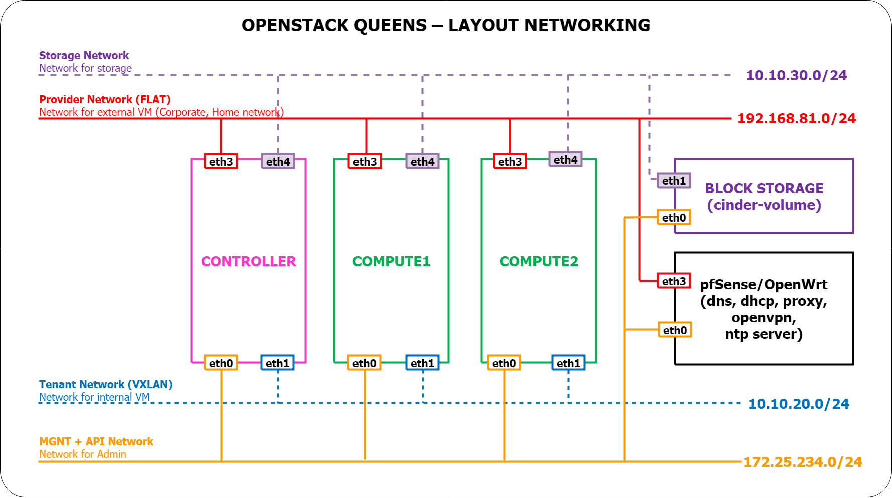
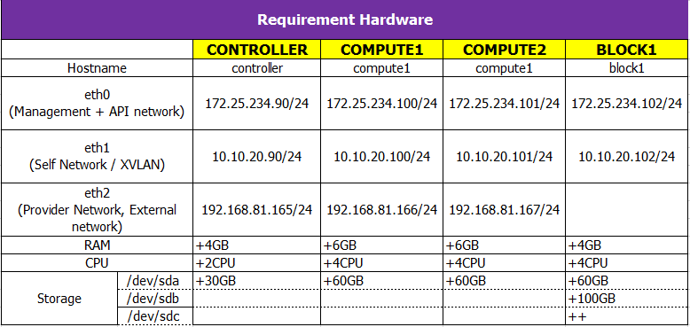
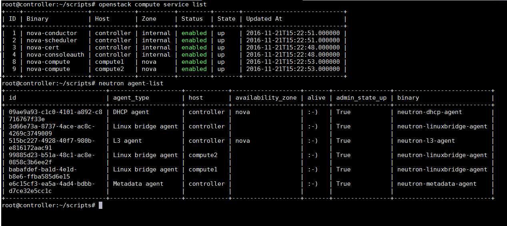

# OpenStack Stein | Mini LAB

A small script used for deploy OpenStack Stein

Supported OS:
- Ubuntu Bionic Beaver 18.04 LTS

## Topology



## Hardware requirements



# Step 1: Network setup

Changing network interfaces name

Edit your /etc/default/grub changing the line from `GRUB_CMDLINE_LINUX=""` to `GRUB_CMDLINE_LINUX="net.ifnames=0 biosdevname=0"`
and, finally:

```sh
$ sudo update-grub
$ sudo reboot
```

Ubuntu 18.04 moved `/etc/network/interfaces` to netplan. You need update IP config at `/etc/netplan/*.yaml`

Example config `/etc/netplan/01-netcfg.yaml`

```
# This file describes the network interfaces available on your system
# For more information, see netplan(5).
network:
  version: 2
  renderer: networkd
  ethernets:
    eth0:
      dhcp4: yes
    eth1:
      addresses:
        - 10.10.20.90/24
    eth2:
      dhcp4: yes

```

Then execute `sudo netplan apply`

# Step 2:
## Install OpenStack cluster
- Login to root user, Download git & and clone scripts

```sh
$ apt-get -y update && apt-get -y install git-core
$ git clone https://github.com/thaivinhtai/openstack-quick-installer.git /root/openstack
$ cd /root/openstack/scripts
$ chmod -R +x *.sh
```

### Controller

- SSH with `root` user and run scripts

```sh
$ source out/vars
$ ./setup01.sh
$ ./setup02.sh controller
$ ./setup03.sh controller
```

### Compute1 and Compute2

- SSH with `root` user and run scripts

```sh
$ source out/vars
$ ./setup01.sh
$ ./setup02.sh compute{1, 2}
$ ./setup03.sh compute{1, 2}
```

### Block

- SSH with `root` user and run scripts

```sh
$ source out/vars
$ ./setup01.sh
$ ./setup02.sh block1
$ ./setup03.sh block1
```

## Install OpenStack All in One

- SSH with `root` user and run scripts

```sh
$ source out/vars
$ ./setup01.sh
$ ./setup02.sh all-in-one
$ ./setup03.sh all-in-one
```

# Step 3: Test operation
## Create demo VMs
```sh
$ . admin-openrc
# Create Cirros images
$ ./test_glace.sh
# Create base network
$ ./test_neutron.sh

# Modify SECURITY_GROUP_ID match with current project
$ ./test_nova_provider_network.sh
$ ./test_nova_self_network.sh
```

## Login dashboad

- Dashboard: `http://<controller mngt IP>/horizon` or `http://${PUBLIC_FQDN_CTL}/horizon`
- User : `admin / admin`

## Check by command or dashboard




# Credit
Thanks to @PT Studio https://github.com/pt-studio/openstack-queens-labs.git
